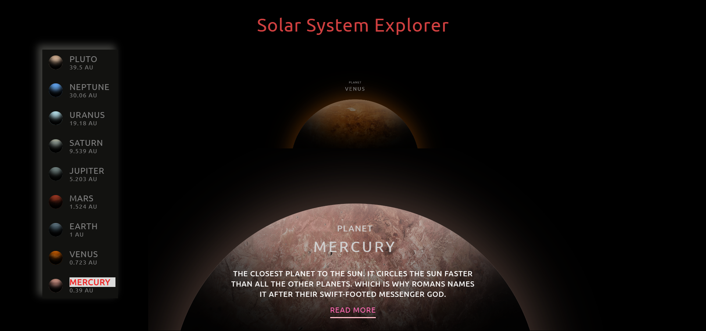

# Solar System Explorer

This is a solar system explorer using html,css,vanilla javascript
Feel free to give any suggestions, improvements, download/pull the repository :)

## Table of contents

- [Overview](#overview)
  - [Description](#Description)
  - [Screenshot](#screenshot)
  - [Links](#links)
- [My process](#my-process)
  - [Built with](#built-with)
  - [Future development](#Future-development)
  - [New changes](#New-changes)
- [Author](#author)

## Overview

### Description

- This is a solar system explorer which gives details about each planets in our solar system in animated way using javascript
- Currently it is only desktop supported :(
- Users can use mouse wheel to navigate through planets

### Screenshot

### Links

- Live Site URL: [https://adarshshanbhag5.github.io/solar-system-explorer/](https://adarshshanbhag5.github.io/solar-system-explorer/)

## My process

### Built with

- Semantic HTML5 markup
- CSS
- Vanilla javascript

### Future development

- Try to make it usable in mobile devices

### New changes

- Added readme :)

## Author

- Adarsh Shanbhag
- Twitter - [@Adarshshanbhag5](https://www.twitter.com/Adarshshanbhag5)
